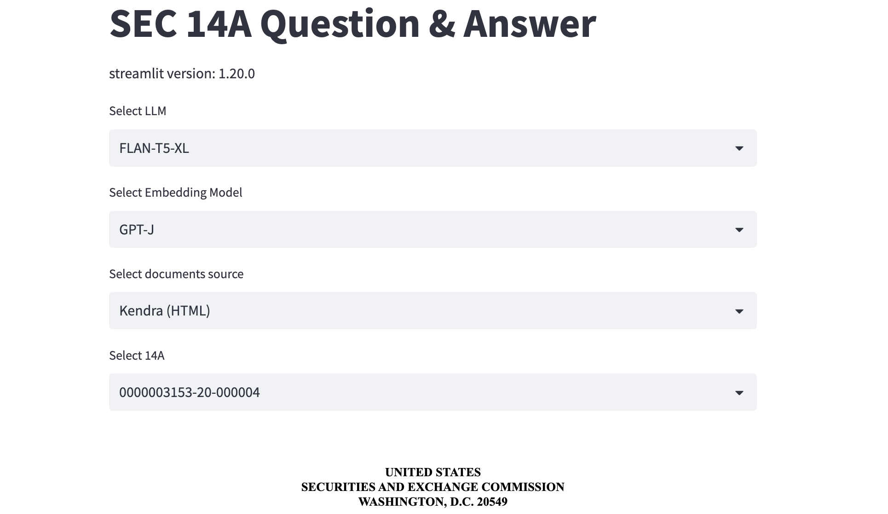
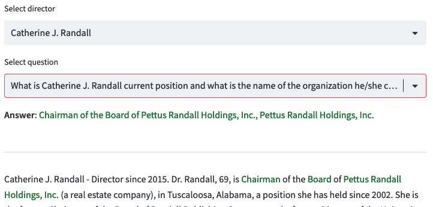

## Leveraging your data with GenAI

Extracting information from documents is a complex process since the document formats can vary and 
the information is presented in paragraphs and table format. 

This repository contains the code source of the Workshop called: [Leveraging your data with GenAI](https://catalog.us-east-1.prod.workshops.aws/workshops/89d52d78-cc4d-45c3-9f5f-91476547b215/en-US). During the workshop, you will use create a question and answer based solution using Generative AI empowered by LLMs and enterprise search capabilities that empowers users to ask natural language based questions to gather information. You will get hands on experience using Amazon Bedrock Models,  Amazon Kendra, 
 Amazon OpenSearch, and LangChain library. 
 
    Level: Advanced
    Duration: 90 minutes
    Target Audience: Data Scientist and Data Engineers working with GenAI
    Prerequisites: AWS Account, Admin IAM User, Laptop with a web browser (preferably Chrome or FireFox).


The repo demonstrates capabilities of the following tools and services:

1. Amazon Bedrock 
2. Amazon Kendra
3. Amazon Openseach Serverless
4. Langchain
5. Streamlit


## Deliverables
1. notebooks/ - a few intro-level notebooks
2. src/ - a complex Q/A demo with Bedrock and backend doc stores

## Prerequisites

1. Amazon Kendra - pre-install Kendra service and index 14A html files.
2. Amazon OpensearchServerless - pre-install the service and the demo will use it as vector store and will automatically populate with embeddings. The index will require the following settings:
- Security configuration - master user (e.g. root)
- Access Policy - configure domain level access policy - json, e.g. Action: "aos:*"
- In opensearch dashboard, all_access, mapped users, map the root to its backend role.

* Install the python 3.10 conda env
```
conda create --name demo -c conda-forge python=3.10
conda activate demo

pip install --upgrade pip
pip install --no-cache-dir -r requirements.txt
sh demo14a/setup.sh
```

4. Run through notebooks and add the information needed in config.yaml. 


## NOTE: The requirement.txt has fixed libraries. 


## Run
* Run the Streamlit application 
```
sh streamlit/run.sh
```

* Open your web browser and go to the URL provided by Streamlit, for example:  
https://my-server.studio.us-east-1.sagemaker.aws/jupyter/default/proxy/8501/

## Demo preview

Select LLM and document store


Ask questions

